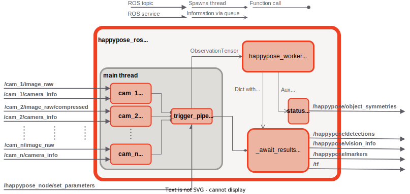

# happypose_ros

[](https://opensource.org/licenses/BSD-2-Clause)
[](https://github.com/agimus-project/happypose_ros/actions/workflows/happypose_ros_build_and_test.yaml
)
[](https://results.pre-commit.ci/latest/github/agimus-project/happypose_ros/main)
[](https://github.com/psf/black)

ROS 2 wrapper for a 6D pose estimation library, [Happypose](https://github.com/agimus-project/happypose).

## Build instructions


> [!WARNING]
> Conda installation is not supported

Currently, there is no automated build for happypose library itself built into the ROS node. Please follow the installation guide found in the [happypose README.md](https://github.com/agimus-project/happypose?tab=readme-ov-file#example-with-venv).

```bash
rosdep update --rosdistro $ROS_DISTRO
rosdep install -y -i --from-paths src --rosdistro $ROS_DISTRO
# parameter --symlink-install is optional
colcon build --symlink-install
```

## Launch

> [!NOTE]
> Intrinsic parameters of the camera are approximate in the demos and may cause inaccurate results! You can change them by modifying the `k_matrix` param in [cosypose_params.yaml](./happypose_examples/config/cosypose_params.yaml) file.

> [!TIP]
> When running the demos, make sure to change `device` parameter according to your hardware configuration!

> [!IMPORTANT]
> Before running the demos download the dataset model and pretrained detectors for object type you plan to use. The default dataset used in the examples is ycbv. For more information refer to [*Downloading and preparing the data* page](https://agimus-project.github.io/happypose/cosypose/download_data.html) in the HappyPose documentation.

To launch the demo run:
```bash
ros2 launch happypose_examples single_view_demo.launch.py use_rviz:=true device:=cpu
```
The launch file exposes `image_path` parameter. It can either be a relative or global path to an image stored on the computer's drive or a path to a video device mapped to a webcam, e.g. `/dev/video0`.

In case your images use different dataset, change the parameter `dataset_name` to a name of a BOP dataset. For supported datasets, see [happypose_ros_parameters.yaml](./happypose_ros/happypose_ros/happypose_ros_parameters.yaml).

To evaluate multi-view capabilities, try:
```bash
ros2 launch happypose_examples multi_view_demo.launch.py use_rviz:=true device:=cpu
```


## ROS API

This ROS node uses the notion of *leading camera*. The leading camera is a user-selected camera used as a reference for all the transformation. The ROS node can have only a single leading camera, and the leading camera cannot have its pose estimated and published. Both detections and estimated camera poses will be converted into *leading camera's* reference frame.

The diagram below shows the basic API of the ROS node, as well as the simplified internal logic of the node.

<div align="center">
  
</div>

The node provides the following ROS topics:

### Publishers

- **happypose/detections** [vision_msgs/msg/Detection2DArray]

    Array containing successful detection of the objects. Detections are marked with class ID, pose, and detection score. Single view and multi-view give different results:
    - Single-view: bounding box is populated.
    - Multi-view: no bounding box. Results are represented in the *leading camera* reference frame. Detections are the result of CosyPose multi-view algorithm.

    Timestamp in the message's header is set to the moment it is published, after the pose etimation pipeline finished. Timestamps of each result are the same as the timestamp of the image used for the detection. In case of multiview see parameter **time_stamp_strategy** for more information.

- **happypose/vision_info** [vision_msgs/msg/VisionInfo]

    Information about the used pose estimator (currently only CosyPose is supported) and URL with object database location.

- **happypose/object_symmetries** [happypose_msgs/msg/ObjectSymmetriesArray] (*QOS: TRANSIENT_LOCAL*)

    Discrete and continuous symmetries of objects in the dataset.

- **happypose/markers** [visualization_msgs/msg/MarkerArray]

    Array of markers used to visualize detections with their meshes in software like RViz 2.

    Enabled by the parameter **visualization.publish_markers**.

- **/tf** [geometry_msgs/msg/TransformationStamped]

    Transformation between the *leading camera* and the camera of which pose is estimated.

    Enabled by the parameter **cameras.\<camera name\>.publish_tf**.

### Subscribers

- **\<camera name\>/image_raw** [sensor_msgs/msg/Image]

    Video stream from a given camera. This is a default topic subscribed by a given camera. Can be changed to compressed image via parameters.

    Disabled by the parameter **cameras.\<camera name\>.compressed**.

- **\<camera name\>/image_raw/compressed** [sensor_msgs/msg/CompressedImage]

    Compressed video stream from a given camera.

    Enabled by the parameter **cameras.\<camera name\>.compressed**.

- **\<camera name\>/camera_info** [sensor_msgs/msg/CameraInfo]

    Topic used to obtain intrinsic matrix of a given camera.

    Disabled by the parameter **cameras.\<camera name\>.k_matrix**.

### Service Servers

- **/happypose_ros/set_paramters** [rcl_interfaces/srv/SetParameters]

    Allows to dynamically change ROS parameters. For more information. For more information, refer to the [documentation](https://docs.ros.org/en/humble/Tutorials/Beginner-CLI-Tools/Understanding-ROS2-Parameters/Understanding-ROS2-Parameters.html).

### Parameters

Parameters are generated with [generate_parameter_library](https://github.com/PickNikRobotics/generate_parameter_library). Currently, no automatic documentation generation is set up. Refer to [happypose_ros_parameters.yaml](./happypose_ros/happypose_ros/happypose_ros_parameters.yaml) for more information.

Note that some of the parameters are possible to tune in the runtime. Refer to the code generation YAML file to see which of them are available.

For examples on how to configure the node, see the examples for [single-view](./happypose_examples/config/cosypose_params.yaml) and [multi-view](./happypose_examples/config/cosypose_params_multiview.yaml).
